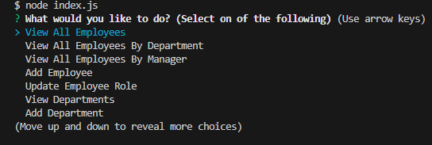
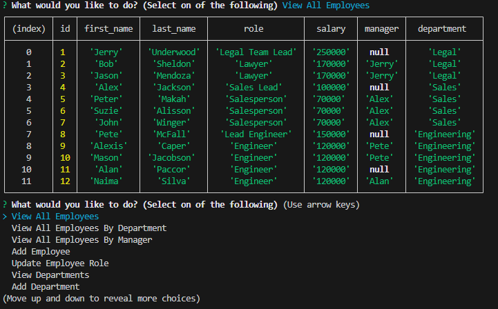

# Employee Management System

# Walkthrough
https://youtu.be/60ffacNwl0g

## Description

The Employee Management System is a command-line application that allows users to manage employee data within a company. It provides options to view and manipulate departments, roles, and employees.

## Table of Contents

- [Installation](#installation)
- [Usage](#usage)
- [Features](#features)
- [Contributing](#contributing)
- [License](#license)

## Installation

1. Clone the repository to your local machine.
2. Navigate to the project directory in your terminal.
3. Run `npm install` to install the required dependencies.

## Usage

To start the application, run `node index.js` in your terminal. You will be presented with a list of options to choose from:

- View All Employees
- View All Employees By Department
- View All Employees By Manager
- Add Employee
- Update Employee Role
- View Departments
- Add Department
- View Roles
- Add Role
- View Totalized Budget
- I am finished

Choose the appropriate option to perform the desired action.

## Features

- View all departments, roles, and employees.
- Filter employees by department or manager.
- Add new employees, roles, and departments.
- Update an employee's role.
- View totalized budget for a specific department.

## Contributing

Contributions are welcome! If you'd like to contribute to this project, please follow these steps:

1. Fork the repository.
2. Create a new branch for your feature or bug fix.
3. Implement your changes and commit them.
4. Push your changes to your fork.
5. Open a pull request describing your changes.

## License

This project is licensed under the [MIT License](LICENSE).
